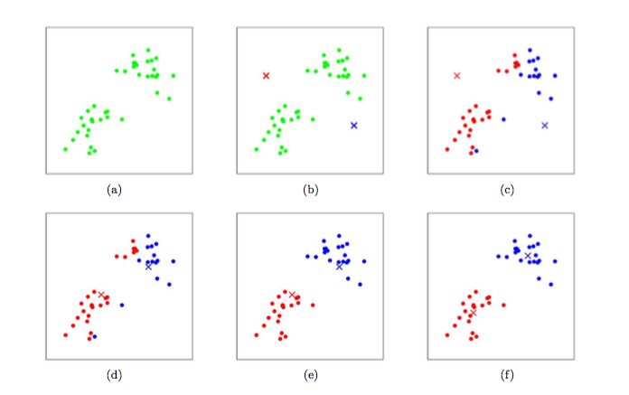

# K均值

> 无监督聚类算法

## 问题建模

> 如何把样本划分成k个聚类?

## 目标函数

> 该目标函数也叫失真代价函数。用于表示所有的样本到相应的聚类中心的距离平方和，它可以用于衡量聚类算法的性能，该值越小说明聚类的效果越好。

$J(c, \mu) = \sum_{j=1}^{k}\sum_{X \in c_j}\|X-\mu_i\|^2$

以上，$c={c_1,c_2,\dots,c_k}$表示划分得到各个样本聚类集合。$\mu_i = \frac{1}{|c_i|}\sum_{X \in c_i}X $，用于表示聚类集合i的聚类中心点。

以上函数不是凸函数，是一个NP难问题。K均值算法采用了贪心策略，通过迭代优化来近似求解式。

## 求解算法

### 基本K均值算法

算法流程:

1. 随机生成k个聚类中心$\mu_1,\mu_2,\dots,\mu_k \in \R^n$

2. 把每个样本标注成距离其最近的聚类中心的索引号，即

   $c^i := \arg \min_j \|X^i-\mu_j\|^2$

3. 对所有样本分完类之后，需要根据新的分类结果对聚类中心进行更新:

   $\mu_j := \frac{\sum_{i=1}^{m}1\{c^i=j\}X^i}{\sum_{i=1}^{m}1\{c^i=j\}}$

4. 不断重复2，3步骤，直至算法收敛

下图显示了，样本进行k均值聚类时，样本分类的情况以及聚类中心的变化:



### 二分K均值算法

伪代码形式：

```
将所有点看成一簇
	当簇数目小于k时:
		对于每一个簇
		在给定的簇上面进行K-均值聚类(k=2)
		计算将该簇一分为二之后的总误差
		选择使得误差最小的那个簇进行划分操作
```

## K值的选择

- 肘部法则(Elbow method),画出k值和目标函数之间的关系图，如果存在拐点，那么取拐点处的k值
- 对于不存在拐点的情况，则需要人为判断来选择，这时候可以通过观察数据的分布来选择k值。

## 性能度量

### SSE(Sum of Squared Error)

> 误差平方和用于度量聚类效果的指标。SSE值越小表示数据点越接近它们的类重心，聚类效果也越好。

降低SSE的方法:

- 增加簇的个数

  > 具体的方式是，将具有最大SSE值的簇划分成两个簇。具体实现就是把这个簇里包含的所有样本点，单独提取出来，进行K均值算法划分。

- 簇合并

  > 当簇的数目太多的时候，需要进行簇合并。合并的方法有两种:1、合并最接近的类重心，即通过计算所有类重心之间的距离，然后合并距离最近的两个类重心。2、直接合并进行两两类重心合并，然后计算合并后新的类重心对应的SSE，最后采取SSE最小的那个合并方式。

## 优缺点

- 优点
  - 容易实现
- 缺点
  - 可能收敛到局部最小值
  - 在大规模数据集上收敛较慢

## 适用范围以及应用

适用数据类型:数值型数据。聚类算法可用于离群点检测，离群点检测应用也很普遍，比如飞机零件的评测，信用卡消费行为异常监控等。k均值聚类算法还可以进行图片压缩。