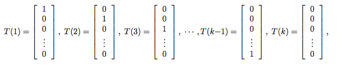
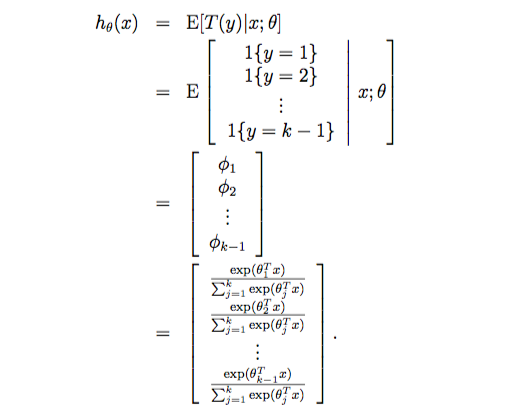

# 广义线性模型

##模型描述

GLM(Generalized Linear Model)的形式化定义，GLM有三段假设:

1. $y|X;\theta \sim $ExpFamily$(\eta)$，表示给定样本X与参数$\theta$，样本分类y服从指数分布族中的某个分布。
2. 给定一个X，我们需要的目标函数为$h_\theta(X) = E[T(y)|X]$，即给定X求T(y)的期望。通常T(y)=y，在logsitc模型中，$h_\theta(X) = E[y|X;\theta]=0.P(y=0|X;\theta)+1*P(y=1|X;\theta)=P(y=1|X;\theta)$
3. $\eta = \theta^TX$

##举例

###伯努利分布

根据上面三段假设，我们可以推导出logistic模型:
$$
\begin{align*}
h_\theta(X) &=E[T(y)|X]= E[y|X;\theta]=0.P(y=0|X;\theta)+1*P(y=1|X;\theta)=P(y=1|X;\theta) = \phi \\
&= \frac{1}{1+e^{-\eta}} \\
&= \frac{1}{1+e^{\theta^TX}}
\end{align*}
$$

> 令$g(\eta) = E[y|X;\theta]$，这里的函数$g(\eta)$称为正则响应函数(canonical response functions)，$g^{-1}$为正则关联函数(canonical link functions)。也就是说logistic函数为正则响应函数，logit函数为正则关联函数。

###高斯分布

同样的对于最小二乘模型，推导过程如下:
$$
h_\theta(X) = E[T(y)|X] = E[y|X] = \mu = \eta = \theta^TX
$$

> 对于高斯分布$E[y|X;\theta]$表示概率分布的期望值，也就是高斯分布中的$\mu$。它的正则响应函数为$g(\eta) = \eta$，而正则关联函数为$g^{-1}$

### 多项式分布

$h_\theta(X) = E[T(y)|X] $，$y \in \{1,2,\dots,k\}$，k种分类。

$P(y=i|\phi) = \phi_i$，特别的$P(y=k;\phi)=1-\sum_{i=1}^{k-1}\phi_i=\phi_k$

参数为$\phi_1,\phi_2,\dots,\phi_{k-1}$，注意这里的$\phi_k$不是参数因为它可以由其他参数来表示。

$T(y) \in \R^{k-1}$，即:

这里的$T(y) \neq y$，令$(T(y))_i = 1\{y=i\}$，即当y为第i类时，T(y)的第i个分量为1，同时$E[(T(y))_i] = P(y=i)=\phi_i$，所以我们有：
$$
\begin{align*}
P(y;\phi) &= \phi_1^{1\{y=1\}}\phi_2^{1\{y=2\}}\dots \phi_k^{1\{y=k\}} \\
&=  \phi_1^{1\{y=1\}}\phi_2^{1\{y=2\}}\dots \phi_k^{1-\sum_{i=1}^{k-1}1\{y=i\}} \\
&= \phi_1^{(T(y))_1}\phi_2^{(T(y))_2}\dots \phi_k^{1-\sum_{i=1}^{k-1}(T(y))_i} \\
&= \exp((T(y))_1\log(\phi_1)+(T(y))_2\log(\phi_2) +\dots + (1-\sum_{i=1}^{k-1}(T(y))_i)\log(\phi_k)) \\
&= \exp((T(y))_1\log(\frac{\phi_1}{\phi_k})+(T(y))_2\log(\frac{\phi_2}{\phi_k}) +\dots + \log(\phi_k)) \\
&= b(y)\exp(\eta^TT(y) - a(\eta))
\end{align*}
$$
求解得:
$$
\begin{align*}
\eta &= 
\left[
\begin{matrix}
\log\frac{\phi_1}{\phi_k} \\
\log \frac{\phi_2}{\phi_k} \\
\vdots \\
\log\frac{\phi_{k-1}}{\phi_k}
\end{matrix}
\right]
\end{align*}
$$

$$
\begin{align*}
a(\eta) &= -\log(\phi_k) \\
b(y) &= 1
\end{align*}
$$

正则关联函数(分布的自然参数)为：
$$
\eta_i = \log\frac{\phi_i}{\phi_k} \ , i=1,\dots,k
$$
对正则关联函数求逆，得到正则响应函数：
$$
\begin{align*}
e^{\eta_i} &= \frac{\phi_i}{\phi_k} \\
\phi_k e^{\eta_i} &= \phi_i \\
\phi_k \sum_{i=1}^{k}e^{\eta_i} &= \sum_{i=1}^{k}\phi_i = 1
\end{align*}
$$
推出$\phi_k = 1/\sum_{i=1}^{k}e^{\eta_i}$，$\phi_i = \frac{e^{\eta_i}}{\sum_{j=1}^{k}e^{\eta_j}}$，所以根据上面的正则关联函数的表示，可得:
$$
\eta_i = \theta_i^TX \ , i=1,\dots,k-1
$$

$$
\begin{align*}
P(y=i|X;\theta) &= \phi_i \\
&= \frac{e^{\eta_i}}{\sum_{j=1}^{k}e^{\eta_j}} \\
&= \frac{e^{\theta_j^TX}}{\sum_{j=1}^{k}e^{\theta_j^TX}}
\end{align*}
$$

那么，我们的假设函数就可以表示为: 
  

## 结论

对于广义线性模型，需要决策的是选用什么样的分布。当选取高斯分布时，就得到最小二乘模型。当选取伯努利分布时，就得到logistic模型。我们这里所说的模型指的是假设函数h。