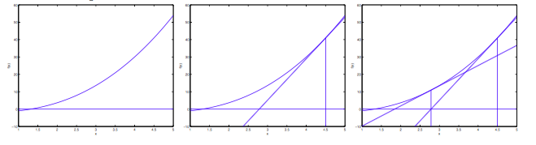
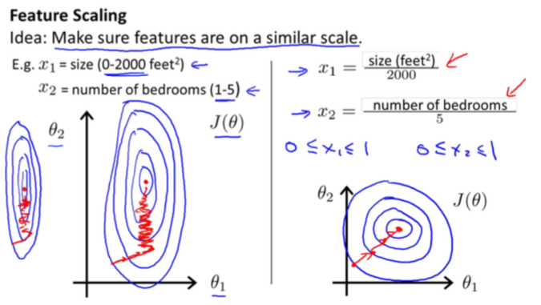

# 梯度下降算法

##批梯度下降算法

###证明

函数的泰勒级数展开：

标量：
$$
f(x+\Delta x) \approx f(x)+f^{'}(x) \Delta x+\frac{1}{2}f^{''}(x)\Delta x^2 \tag{1}
$$
令$\Delta x = -\eta f^{'}(x)$，$\eta$为学习速率。代入公式，可以得到结论$f(x+\Delta x) < f(x)$。

向量:
$$
f(X+\Delta X) \approx f(X) + g^T(X)\Delta X+\frac{1}{2}\Delta X^T H(X)\Delta X \tag{2}
$$
向量的泰勒级数展开的变量$X$和$\Delta X$都为向量。其中$g^T(X)$为函数$f$关于$X$的梯度，$H(X)$为函数$f$关于$X$的海森矩阵。同样，令$\Delta X = -\eta g^T(X)$，得到结论$f(X+\Delta X) < f(X)$。

###举例说明

> 1. 为什么沿着梯度的反方向更新参数，可以使参数函数逐步变小，然后慢慢收敛？
> 2. 为什么学习速率太大会导致梯度下降算法无法收敛？
>
> 以下举个简单的例子说明。

另代价函数为$J(\theta) = \theta^2$，那么$\theta$的导数为$2\theta \ ， $$\theta$的梯度下降更新规则是：
$$
\theta := \theta - \eta \nabla J(\theta) \\
\theta := \theta - 2\eta \theta
$$
**令$\eta = 0.25$，$\theta=10$**

1. $\theta = 10 - 0.5*10 $，$\theta = 5$
2. $\theta = 5 - 0.5*5 $，$\theta = 2.5$
3. $\theta = 2.5 - 0.5*2.5 $，$\theta = 1.25$

从上面的推导过程可以看到$\theta$在逐步变小，慢慢趋向于0，对于凸函数，导数为0的点就是函数的最小值点。

**令$\eta = 1, \theta = 10$**

1. $\theta = 10 - 2*10 $，$\theta = -10$
2. $\theta = -10 + 2*10 $，$\theta = 10$

从上面的推导过程可以看到$\theta$的值一直在振荡，没有逐步变小，导致**算法无法收敛**。原因在于**学习速率$\eta$太大**了。

对于上面**假设的$\theta=-10$时**，上面的**推导依然成立**。

## 随机梯度下降算法

## 牛顿法

通过牛顿法来求函数$f(\theta)=0$对应的$\theta^{'}$点。对应于批量梯度下降的更新规则，牛顿法的参数更新规则如下:
$$
\theta :=\theta - \frac{f(\theta)}{f^{'}(\theta)}
$$
如图所示:

图一表示，函数$f(\theta)$和$\theta$之间的关系。图二表示函数在$\theta^0$点处的切线，切线与$\theta$坐标的交点记为$\theta^1$，根据导数的定义，$f^{'}(\theta^0) = \frac{f(\theta^0)}{\theta^0-\theta^1}$，令$\Delta = \theta^0-\theta^1$，则有$\Delta = \frac{f(\theta^0)}{f^{'}(\theta^0)}$，$\theta^1 = \theta^0 - \frac{f(\theta^0)}{f^{'}(\theta^0)}$。由此可以得到递推公式:
$$
\theta^{n+1} = \theta^n - \frac{f(\theta^n)}{f^{'}(\theta^n)}
$$

###应用

把牛顿法应用到求解凸函数的极值点，也就是求使得凸函数的梯度为0的点。应用牛顿法可得出以下更新规则:

- 标量的情况,令函数为$J(\theta)$，求解导数为0，即$J^{'}(\theta) = 0$。

$$
\theta^{n+1} = \theta^{n} - \frac{J^{'}(\theta^n)}{J^{''}(\theta^n)}
$$

- 向量的情况，令函数为$J(\theta)$，求解梯度为0，即$\nabla J(\theta) = 0$。

$$
\theta^{n+1} = \theta^{n} - H^{-1}\nabla J(\theta)
$$

此处的$H^{-1}$表示函数的海森矩阵的逆。

### 优缺点

- 缺点
  - 海森矩阵的计算量很大
- 优点
  - 收敛速度快(二次收敛quadratic conversions)

## 算法优化

### 特征缩放

当所有的特征取值范围相差很大(数据的偏度skewness很大)的话，会影响梯度下降的收敛速度。如下图所示:

