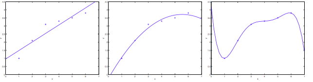
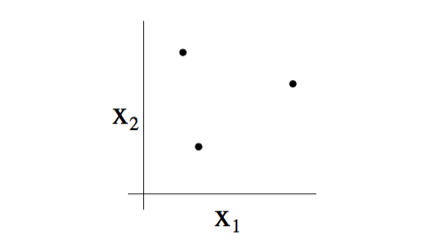
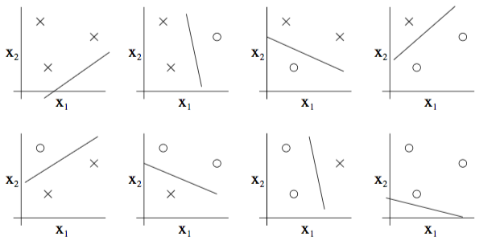
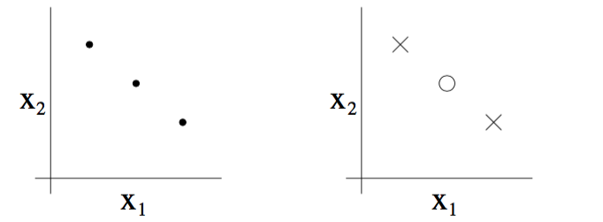

# 经验风险最小化理论

## 偏差和方差的权衡

前面我们使用线性模型和多项式模型来举例说明欠拟合和过拟合的案例。如下图所示：

我们可以看到样本呈现非线性分布。第一个图中显示如果使用线性模型来拟合($y=\theta_0+\theta_1x$)，那么会出现欠拟合的问题。第三个图中显示如果使用次数很高的多项式模型来拟合($y=\theta_0+\theta_1x+\dots+\theta_5x^5$)，那么会出现过拟合的问题。而中间的图显示，如果使用次数正好的多项式来拟合，比如($y=\theta_0+\theta_1x+\theta_2x^2+\theta_3x^3$)来进行拟合，那么效果会刚刚好。这里只是举例说明欠拟合和过拟合的问题，具体使用什么样的模型既能很好的拟合数据集又能有比较好的泛化能力，需要具体问题具体分析。

欠拟合对应着高偏差，而过拟合对应着高方差。对偏差和方差的权衡是学习理论着重要解决的问题。

## 前言

在进行偏差和方差进行权衡前，我们需要解决下面这些问题。第一个问题，我们可不可以**把偏差和方差的权衡公式化**?这个问题会最终把我们引导到如何进行模型选择，也就是说可以自动找到适合的$x$的次数。第二个问题，我们能不能把模型**在训练集上的误差**和**泛化误差**联系起来？最后一个问题，**是否存在某些判定条件**，使得满足这些条件的算法模型可以工作的很好(**既不过拟合也不欠拟合**)。

**引理:**(联合界The union bound)假设$A_1,A_2,…,A_k$是k个不同的事件(事件之间有可能不是相互独立的)，以下结论成立:$P(A_1\cup A_2\dots \cup A_k) \leq P(A_1)+\dots+P(A_k)$。

**引理:**(Hoeffding不等式)假设$Z_1,\dots,Z_m$为m个独立同分布分布的随机变量，它们服从均值为$\phi$的伯努利分布。即$P(Z_i=1) = \phi$和$P(Z_i=0)=1-\phi$。令$\hat{\phi} = \frac{1}{m}\sum_\limits{i=1}^{m}Z_i$。存在$\gamma > 0$,使得：
$$
P(|\phi-\hat{\phi}| > \gamma) \leq 2\exp(-2\gamma^2m) 
$$
通过上面的理论可知，只要m足够大(**正常情况下，对任意m都成立**)，我们就可以使用$\hat{\phi}$来估计$\phi$。比如说，你有一个存在偏见的硬币(就是头像朝上的概率大于花朝上的概率)，头像朝上的概率是$\phi$，如果你做m次试验，然后计算出头像朝上的比率$\hat{\phi}$，如果m足够大，那么就可以使用$\hat{\phi}$来估计$\phi$。

### 学习理论建模(以二分类为例)

给定训练样本$S = \{(X^i,y^i) \ , i=1,\dots,m \}$，$y \in \{1,0\}$，所有的样本都满足独立同分布，且服从$\mathcal{D}$分布，假设函数为$h$，我们定义**训练误差(也叫经验风险或经验误差)**:
$$
\hat{\epsilon}(h) = \frac{1}{m}\sum_{i=1}^{m}1\{h(X^i) \neq y^i\}
$$
**泛化误差定义**为:
$$
\epsilon(h) = P_{(X,y)\sim \mathcal{D}}(h(X) \neq y)
$$
泛化误差表示取出一个不在训练样本中，服从$\mathcal{D}$分布的新样本，假设函数会对它误分类的概率。

令$h_\theta(X) = 1\{\theta^TX \geq 0\}$, **ERM定义**为
$$
\hat{\theta} = \arg \min_\theta \hat{\epsilon}(h_\theta)
$$
那么$\hat{h} = h_{\hat{\theta}}$。

对于ERM来说，因为它是非凸的，所以无法使用凸优化算法来求解，所以我们只用另外一种等价的定义:

假设模型集合为:$\mathcal{H} = \{h_\theta: \theta \in \R^{n \times 1}\}$

那么，**ERM定义修正**为:
$$
\hat{h} = \arg \min_{h \in \mathcal{H}} \hat{\epsilon}(h)
$$

## 一致收敛证明

> 一致收敛定理就是训练误差和泛化误差随着样本数目的增大而更加接近。

### 有限模型集合

定义模型集合为:
$$
\mathcal{H} = \{h_1,h_2,\dots,h_k\}
$$
首先我们需要证明，对于所有的模型h来说，$\hat{\epsilon}$是$\epsilon$的一个很好的估计。其次，需要证明使用ERM方法得到的$\hat{h}$的泛化误差是有上限的。

####第一个结论证明:

从模型中任意选择一个模型$h_j$， 令$Z = 1\{h_i(X) \neq y\}$，比如样本j被错误分类可表示成$Z_j = 1\{h_i(X^j) \neq y^j\}$，
$$
P(Z_i = 1) = \epsilon(h_j) \sim Bernoulli(\phi)
$$
那么训练误差为:
$$
\hat{\epsilon}(h_i) = \frac{1}{m}\sum_{j=1}^{m}Z_j
$$
应用**Hoeffding不等式引理**，可得:
$$
P(|\epsilon(h_i)-\hat{\epsilon}(h_i)| > \gamma) \leq 2\exp(-2\gamma^2m)
$$
得证！

#### 第二个结论证明:

令事件$A_j$为$|\epsilon(h_j)-\hat{\epsilon}(h_j)| > \gamma$，那么有:
$$
P(A_j) \leq 2\exp(-2\gamma^2m)
$$
那么可以推导出至少存在一个模型$h_i$,使得事件$A_j$发生的概率为:
$$
P(\exists h \in \mathcal{H},A_j) = P(A_1\cup \dots \cup A_k) \leq P(A_1)+\dots+P(A_k) \leq 2k\exp(-2\gamma^2m)
$$
用1同时减去不等式的两侧，可得:
$$
P(\neg \exists h \in \mathcal{H}, A_j)=P(\forall h \in \mathcal{H},|\epsilon(h_i)-\hat{\epsilon}(h_i)|\leq\gamma) \geq 1-2k\exp(-2\gamma^2m)
$$
**总结:**至少有$1-2k\exp(-2\gamma^2m)$的概率，使得模型集合中的所有假设，其泛化误差都在训练误差的$\gamma$范围内。也就是说当m很大时，所有的$\hat{\epsilon}(h)$会同时收敛到$\epsilon(h)$

#### 一致收敛的推论

在一致收敛中，有三个参数，样本数m，$\gamma$，以及使用训练误差来估计泛化误差产生的差异在$\gamma$范围内的概率。我们可以通过固定其中两个，来推出第三个。其中固定m,$\gamma$来求概率前面已经证明了。

- **样本复杂度**，通过固定$\gamma$和概率，求m

给定$\gamma$和$\sigma > 0$，请问需要多少样本，可以保证在至少有$1-\sigma$的概率，使得泛化误差在训练误差的$\gamma$范围内？即求解:
$$
1-2k\exp(-2\gamma^2m) \geq 1-\sigma
$$
可解得:
$$
m \geq \frac{1}{2\gamma^2} \log \frac{2k}{\sigma}
$$
**总结:**一个算法模型要达到一个确定的性能时，需要的样本数目。也成为算法的样本复杂度。可以看到m和log(k)成正比，这里log(k)有一个经验值范围$\log k \leq 30$。

- **误差界(error bound)**，给定m和$\sigma > 0$，泛化误差会落在训练误差的什么范围内? 即求解:

$$
1-2k\exp(-2\gamma^2m) \geq 1-\sigma
$$

$\forall h \in \mathcal{H}$，可解得:
$$
|\hat{\epsilon(h)}-\epsilon(h)| \leq \sqrt{\frac{1}{2m}\log \frac{2k}{\sigma}}
$$
因为$|\hat{\epsilon}(h)-\epsilon(h) \leq \gamma$，所以:
$$
\gamma = \sqrt{\frac{1}{2m}\log \frac{2k}{\sigma}}
$$

接下来，评估通过ERM方法求得的模型$\hat{h}$的泛化能力。

### 泛化能力评估

令$h^* = \arg \min_{h\in \mathcal{H}} \epsilon(h)$，$h^*$为模型集合$\mathcal{H}$中泛化误差最小的模型，$\hat{h} = \arg \min_{h \in \mathcal{H}} \hat{\epsilon}(h)$，有:
$$
\epsilon(\hat{h}) \leq \hat{\epsilon}(\hat{h})+\gamma \leq \hat{\epsilon}(h^*)+\gamma \leq \epsilon(h^*) +2\gamma
$$
第一个不等号成立是一致收敛定理的应用；第二个不等号成立是$h^*$的定义决定的;第三个不等号成立仍然是一致收敛定理的应用。**上式表明：**在一致收敛定理成立的时候，通过ERM得到的训练误差最小的模型在泛化能力上最多比泛化能力最好的模型差$2\gamma$。

**定理:**令$|\mathcal{H}|=k$，给定m和$\sigma > 0$，那么至少有$1-\sigma$的概率能够使下面式子成立:
$$
\epsilon(\hat{h}) \leq \min_{h\in \mathcal{H}} \epsilon(h) + 2\sqrt{\frac{1}{2m}\log \frac{2k}{\sigma}}
$$
该定理量化了偏差和方差的权衡。可以使用该定理来进行模型选择。假设我把模型集合从线性模型集合变成同时包含线性模型集合和二次模型集合时，那么$h^*$的效果会更好，也就是说它会使得右边式子第一项减小，但是由于模型集合变大，导致k增大，也就是右边式子的第二项也会跟着变大。

从定理中可以发现，不等式右边的第一项用于表示偏差，第二项用于表示方差。所以当模型集合很大时，第一项会减小，也就是偏差会减小，而第二项会变大，也就是方差会增大。

同样地，该定理还有另外形式的推论:

**定理:**令$|\mathcal{H}| = k$,给定$\gamma$和$\sigma > 0$，那么至少有$1-\sigma$的概率使$\epsilon(\hat{h}) \leq min_{h\in \mathcal{H}} \epsilon(h)+2\gamma = \epsilon(h^*)+2\gamma$成立，前提条件是:
$$
m \geq \frac{1}{2\gamma^2} \log \frac{2k}{\sigma} = O(\frac{1}{\gamma^2}\log \frac{2k}{\sigma})
$$

### 无限模型集合

对于一个模型来说，比如logistic模型，如果有n个feature，那么该模型会有d=n+1个参数。虽然理论上d个参数的取值都有无穷多个，使得模型集合无限大。但实际上，在计算机中每个参数都以64bit来表示，那么就需要64d bit来表达这个模型的集合，考虑到每bit有0,1两种状态，那么在计算机的表达中，这个无限大的模型集合的大小为$2^{64d}$,即$|\mathcal{H}|=2^{64d}=k$。

根据有限集合的结论，则有:
$$
m \geq \frac{1}{2\gamma^2}\log \frac{2k}{\sigma} = O(\frac{d}{\gamma^2}\log\frac{1}{\sigma})
$$
**结论**：一个包含d个参数的无限模型集合至少有$1-\sigma$的概率使$\epsilon(\hat{h}) \leq \min_{h\in \mathcal{H}}\epsilon(h)+2\gamma$成立的前提是至少有与特征数目同一数量级的样本数目。

####VC维

使用参数数目对模型复杂度进行衡量的方法有缺陷，比如对于同样的模型，不同的表达形式就有不同的参数数目。比如logistic模型来说，下面两个公式都可以用来描述logistic模型:
$$
h_\theta(X) = 1\{\theta_0+\theta_1X^1+\dots+\theta_nX^n \geq 0\}
$$

$$
h_{u,v}(X) = 1\{(u_0^2-v_0^2)X^1+\dots+(u_n^2-v_n^2)X^n \geq 0\}
$$

虽然模型集合$\mathcal{H}$是一样(n维线性模型集合)，但是参数数目却是两倍的关系。

给定集合$S = \{x^1,x^2,\dots,x^d\}$，我们称模型集合$\mathcal{H}$可以分散$S$，当且仅当对于集合S的任意一种标记方式，$\mathcal{H}$中总存在一种假设h, 可以将其线性分开。

如下图所示，在二维平面中，对于三个点的集合:

我们可以使用模型集合($\mathcal{H}$即二维线性分类器模型表示为$h_\theta(x) = 1\{\theta_0+\theta_1x_1+\theta_2x_2 \geq 0\}$)来分散上面的集合。

如下图所示，对于三个样本的对应的8种不同标签的组合，我们都可以找到一个线性分类器模型来使它们被正确分类，达到0训练误差:

此外，对于4个点的二维数据集，上面的线性模型集合无法是样本正确分类。因此在二维空间中，线性模型集合$\mathcal{H}$能够分散的样本数为3的集合。尽管3个样本集合，也存在无法分散的情况，如下图:

但是，根据$VC(\mathcal{H})$的定义可知，只要存在一个$d$个样本的集合能够被模型集合$\mathcal{H}$完全分散，那么$VC(\mathcal{H}) = d$。所以二维空间中线性分类器模型集合能够完全分开的样本集合数为3,即$VC(\mathcal{H}) = 3$

**定理:**对于模型集合$\mathcal{H}$，令$d=VC(\mathcal{H})$，那么至少有$1-\sigma$的概率，对于模型集合中的所有模型h来说，我们有:
$$
|\epsilon(h)-\hat{\epsilon(h)}| \leq O(\sqrt{\frac{d}{m}\log \frac{m}{d}+\frac{1}{m}\log\frac{1}{\sigma}})
$$
从而，得到至少有$1-\sigma$的概率，有:
$$
\epsilon(\hat{h}) \leq \epsilon(h^*)+O(\sqrt{\frac{d}{m}\log\frac{m}{d}+\frac{1}{m}\log\frac{1}{\sigma}})
$$
由定理可以看到，当一个模型集合的$VC$为有限的时候，随着样本数目的变大，训练误差与泛化误差将会一致收敛。

**引理:**为了使$|\epsilon(h)-\hat{\epsilon}(h)|\leq \gamma$对模型集合中的所有h都在$1-\sigma$的概率下成立，且$\epsilon(\hat{h}) \leq \epsilon(h^*)+2\gamma$，那么样本数目m必须满足:
$$
m = O_{\gamma,\sigma}(d)
$$
即为了使模型可以达到较好的效果，需要的样本数必须与模型的$VC$维在同一数量级。

## 举例

### VC维解释SVM

SVM通过核函数将数据映射到高维空间，那么相应的，其VC维变大，要达到较好效果所需要的数据量也需要增大。但是SVM只是在原数据上就达到了比其他模型更优的效果，这是为什么呢?

虽然SVM将数据映射到了高维空间，但是其仍然使用的最大间隔分类器的模型。而对于最大间隔分类器模型来说，其VC维并不依赖X的维度。对于最大间隔为$\gamma$的分类器来说，其在$\gamma$范围内的数据点数目设为k，则分类器的VC维满足以下条件:
$$
VC(\mathcal{H}) \leq \lceil \frac{k^2}{\gamma}\rceil + 1
$$
而SVM算法则会自动寻找一个具有较小VC维的模型集合。这样反而降低了VC维，使得数据量变得相对更加充分，提高了模型的效果。