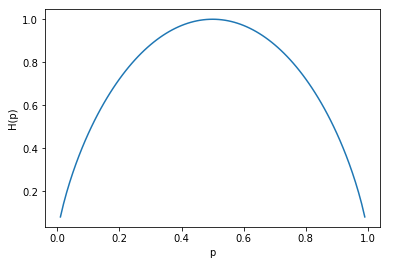

# 决策树

## 定义

分类决策树模型是一种描述对实例进行分类的树型结构。决策树由节点(node)和有向边(directed edge)组成。节点有两种类型:内部节点和叶节点。内部节点表示一个特征或树型，叶节点表示一个类。

用决策树分类，从根节点开始，对实例的某个特征进行测试，根据测试结构，将实例分配到其子节点；这时，每一个子节点对应着该特征的一个取值。如此递归地对实例进行测试并分配，直至达到叶节点。最后将实例分到叶节点的类中。

## 信息增益

###熵

在信息论与概率统计中，熵(entropy)是表示随机变量不确定性的度量。设X是一个取有限个值的离散随机变量，其概率分布为:
$$
P(X=x_i) = p_i , i=1,2,\dots,n
$$
则随机变量X的熵定义为:
$$
H(X) = -\sum_{i=1}^{n}p_i \log p_i \tag{1-1}
$$
由定义可知，熵只依赖于X的分布，而与X的取值无关，所以也可将X的熵记作H(p)，即H(X)=H(p)。

熵越大，随机变量的不确定性就越大，从定义可验证：
$$
\log n = \sum_{i=1}^{n}\frac{1}{n} (-\log \frac{1}{n}) = \sum_{i=1}^{n}\frac{1}{n}\log n \\
0 \leq H(p) \leq \log n \tag{1-2}
$$
当随机变量只取两个值，例如1,0时，即X的分布为：
$$
P(X=1) = p 
P(X=0) = 1-p , 0 \leq p \leq 1
$$
熵为：
$$
H(p) = -p \log p - (1-p)\log (1-p)
$$
这时熵和概率p的函数关系曲线图如下：

当p=0或p=1时，H(p)=0,随机变量完全没有不确定性。当p=0.5时，H(p)=1，熵取最大值，随机变量的不确定性最大。这张图也间接证明了公式(1-2)成立。

设有随机变量(X,Y)，其联合概率分布为:
$$
P(X=x_i,Y=y_j)=p_{ij},i=1,2,\dots,n;j=1,2,\dots,m 
$$
条件熵H(Y|X)表示在已知随机变量X的条件下随机变量Y的不确定性。在给定随机变量X的条件下随机变量Y的条件熵H(Y|X)，定义为给定X的条件下Y的条件概率分布的熵对X的数学期望:
$$
\begin{align*}
H(Y|X) &= \sum_{i=1}^{n}p_iH(Y|X=x_i) \\
&= \sum_{i=1}^{n}p_i\sum_{j=1}^{m}p_{ij} \log p_{ij}
\end{align*} \tag{1-3}
$$
以上n表示X条件有多少个分支。m表示Y条件有多少个分支。$p_{ij}$表示在X条件的i分支下，Y的概率分布。这里，$p_i=P(X=x_i),i=1,2,\dots,n$。

当熵和条件熵中额概率由数据估计(尤其是极大似然估计)得到时，所对应的熵与条件熵分别称为经验熵和经验条件熵。此时，如果有0概率，令0log0 = 0。

### 信息增益的定义

特征A对训练数据集D的信息增益g(D,A)，定义为集合D的经验熵H(D)与给定特征A的条件下D的经验条件熵H(D|A)之差，即:
$$
g(D,A) = H(D) - H(D|A) \tag{1-4}
$$
一般地，熵H(Y)与条件熵H(Y|X)之差称为互信息。决策树学习中的信息增益等价于训练数据集中类与特征的互信息。

在分类算法中，信息增益越大的特征，对数据集的分类能力更强，也就是说把无序数据集变成有序数据集的能力更强。

### 信息增益比

> 这类算法会更加倾向于选择取值较多的特征(分支较多的)的问题。使用信息增益比可以对这一问题进行校正。这时特征选择的另一准则。

特征A对训练数据集D的信息增益比$g_r(D,A)$定义为其信息增益g(D,A)与训练数据集D关于特征A的值的熵$H_A(D)$之比，即：
$$
g_r(D,A) = \frac{g(D,A)}{H_A(D)} \tag{1-5}
$$
其中，$H_A(D) = -\sum_{i=1}^{n}\frac{|D_i|}{D}\log \frac{D_i}{D}$，n是特征A取值的个数。

## 决策树算法

### ID3算法

> ID3算法的核心是在决策树各个节点熵应用信息增益准则选择特征，递归的构建决策树。具体方法是:从根节点开始，对节点计算所有可能的特征的信息增益，选择信息增益最大的特征作为节点的特征，由该特征的不同取值建立子节点；在对子节点递归的调用以上方法，构建决策树；直到所有特征的信息增益均小于或没有特征可以选择位置。最后得到一个决策树。**ID3相当于用极大似然法进行概率模型的选择。**

算法流程:

输入:训练数据集D，特征集A，阈值$\epsilon$;

输出：决策树T

1. 若D中所有实例属于同一类$C_k$，则T为单节点树，并将类$C_k$作为该节点的类标记，返回T
2. 若A=$\varnothing$，则T为单节点树，并将D中实例数最大的类$C_k$作为该节点的类标记，返回T
3. 否则，按公式(1-4)计算A中各特征对D的信息增益，选择信息增益最大的特征$A_g$
4. 如果$A_g$的信息增益小于阈值$\epsilon$，则置T为单节点树，并将D中实例数最大的类$C_k$作为该节点的类标记，返回T
5. 否则，对$A_g$的每一可能值$a_i$，依$A_g=a_i$将D分割为若干非空子集$D_i$，将$D_i$中实例数最大的类作为标记，构建子节点，由节点及其子节点构成树T，返回T
6. 对第i子节点，以$D_i$为训练集，以$A-\{A_g\}$为特征集，递归地调用步骤(1) ~ (5)，得到子树$T_i$，返回$T_i$。

### C4.5算法

> 跟ID3类似，但是C4.5使用信息增益比来选择特征

算法流程:

输入:训练数据集D，特征集A，阈值$\epsilon$;

输出：决策树T

1. 若D中所有实例属于同一类$C_k$，则T为单节点树，并将类$C_k$作为该节点的类标记，返回T
2. 若A=$\varnothing$，则T为单节点树，并将D中实例数最大的类$C_k$作为该节点的类标记，返回T
3. 否则，按公式(1-5)计算A中各特征对D的信息增益比，选择信息增益最大的特征$A_g$
4. 如果$A_g$的信息增益小于阈值$\epsilon$，则置T为单节点树，并将D中实例数最大的类$C_k$作为该节点的类标记，返回T
5. 否则，对$A_g$的每一可能值$a_i$，依$A_g=a_i$将D分割为若干非空子集$D_i$，将$D_i$中实例数最大的类作为标记，构建子节点，由节点及其子节点构成树T，返回T
6. 对第i子节点，以$D_i$为训练集，以$A-\{A_g\}$为特征集，递归地调用步骤(1) ~ (5)，得到子树$T_i$，返回$T_i$。

## 决策树的剪枝

> 上面的决策树构建算法生成的决策树往往对训练样本的分类很准确，但是很容易出现过拟合的问题。过拟合的原因在于学习时过多的考虑如何提高对训练数据的正确分类(贪心算法)，从而构建出过于复杂的决策树。解决这个问题的办法是降低决策树的复杂度。

决策树的剪枝往往通过极小化决策树整体的损失函数或代价函数来实现。

设树T的叶节点个数为|T|,t为树T的叶节点，该叶节点有$N_t$个样本点，其中k类的样本点有$N_{tk}$个，k=1,2,...k，$H_t(T)$为叶节点t上的经验熵，$\alpha \geq 0$为参数，则决策树学习的损失函数可以定义为
$$
C_{\alpha}(T) = \sum_{i=1}^{|T|}N_tH_t(T)+\alpha|T| \tag{2-1}
$$
其中经验熵为:
$$
H_t(T) = -\sum_k \frac{N_{tk}}{N_t} \log \frac{N_{tk}}{N_t} \tag{2-2}
$$
在损失函数中，将公式(2-1)右端的第一项记作：
$$
C(T) = \sum_{t=1}^{|T|}N_tH_t(T) = - \sum_{t=1}^{|T|}\sum_{k=1}^{K}N_{tk}\log \frac{N_{tk}}{N_t} \tag{2-3}
$$
这时有
$$
C_{\alpha}(T) = C(T)+\alpha |T| \tag{2-4}
$$
公式(2-3)表示模型对训练数据的预测误差，即模型与训练数据的拟合程度，|T|表示模型复杂度，参数$\alpha \geq 0$控制两者之间的影响。较大的$\alpha$促使选择较简单的模型，反之，则会产生较复杂的模型。$\alpha=0$表示是考虑模型对训练样本的拟合程度，而不考虑模型的复杂度。

公式(2-4)的极小化等价于正则化的极大似然估计。所以，利用损失函数最小原则进行剪枝就是用正则化的极大似然估计进行模型选择。

### 剪枝算法

输入:生成算法产生的整个树T，参数$\alpha$

输出:修剪后的子树$T_{\alpha}$

1. 计算每个节点的经验熵

2. 递归地从树的叶节点向上回缩。设一组叶节点回缩到父节点之前与之后的整体树分别为$T_B$与$T_A$，其对应的损失函数值分别是$C_{\alpha}(T_B)$与$C_{\alpha}(T_A)$，如果：
   $$
   C_{\alpha}(T_A) \leq C_{\alpha}(T_B)
   $$
   则进行剪枝，即将父节点变为新的叶节点

3. 返回(2)，直至不能继续为止，得到损失函数最小的子树$T_{\alpha}$