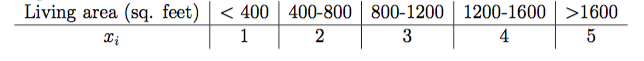

# 朴素贝叶斯

> 朴素贝叶斯模型为生成学习算法。先求出联合概率分布$P(X,y)$，然后通过贝叶斯公式求出后验分布，即$P(y|X)$。

## 问题建模

> 应用判别模型的建模方式，直接对P(X|y)进行建模，那么会遇到参数过多的问题。假设词典拥有50000个词语，即向量长度为50000，向量中的每个分量的取值为{0,1}，那么y就有$2^{50000}$种取值，对其建模则需要$2^{50000}-1$个参数(不考虑全为0的情况？)。因此，NB模型做了一个假设，即朴素贝叶斯假设(由朴素贝叶斯假设推导出的分类器为朴素贝叶斯分类器)。

### 贝叶斯公式

$$
P(y|X) = \frac{P(X|y)P(y)}{P(X)}
$$

### 假设

给定分类y后，假设特征向量中的各个分量是相互独立的。

即满足以下条件:
$$
\begin{align*}
P(x_1,x_2,\dots,x_50000|y) &= P(x_1|y)P(x_2|y,x_1)\dots P(x_{50000}|y,x_1,x_2,\dots,x_{49999}) \\
& = P(x_1|y)P(x_2|y)\dots P(x_{50000}|y) \\
&= \prod_{i=1}^{n}P(x_i|y)
\end{align*}
$$

### 多元伯努利事件模型

> 二分类模型，多元伯努利事件模型(Multi-variate Bernoulli Event Model,简称NB-MBEM)。在文本分类中，该模型使用的是文本的**词集模型(set-of-words)**，即特征向量的每个分量代表词典中对应的单词在文本中出现与否。

词语$x_i$在正样本中出现的概率表示为:

$\phi_{i|y=1} = P(x_i=1|y=1)$

词语$x_i$在负样本中出现的概率表示为:

$\phi_{i|y=0} = P(x_i=1|y=0)$

正样本出现的概率表示为:

$\phi_y=P(y=1)$

给定训练集$\{(X^i,y^i);i=1,\dots,m\}$，对应的联合似然函数(joint likelihood)表示为:
$$
\begin{align*}
\mathcal{L}(\phi_y,\phi_{j|y=0},\phi_{j|y=1}) &= \prod_{i=1}^{m}P(X^i, y^i) \\
&= \prod_{i=1}^{m}P(X^i|y^i)P(y^i) \\
&= \prod_{i=1}^{m}\left( \prod_{i=1}^{n}P(x_j^i|y^i) \right)P(y^i)
\end{align*} \tag{1}
$$
其中，m为样本数，n为词典大小。最大化该函数，即可得到参数的极大似然估计:
$$
\begin{align*}
\phi_{j|y=1} &= \frac{\sum_{i=1}^{m}1\{x_j^i=1 \land y^i=1\}}{\sum_{i=1}^{m}1\{y^i=1\}} \tag{2-1} \\
\phi_{j|y=0} &= \frac{\sum_{i=1}^{m}1\{x_j^i=1 \land y^i=0\}}{\sum_{i=1}^{m}1\{y^i=0\}} \tag{2-2} \\
\phi_y &= \frac{\sum_{i=1}^{m}1\{y^i=1\}}{m} \tag{2-3}
\end{align*}
$$

####预测

对于新样本，按照如下公式计算其概率值:
$$
\begin{align*}
P(y=1|X) &= \frac{P(X|y=1)P(y=1)}{P(X)} \\
&= \frac{P(X|y=1)P(y=1)}{P(X|y=1)P(y=1)+P(X|y=0)P(y=0)} \\
&= \frac{\left(\prod_{i=1}^{n}P(x_i|y=1)\right)P(y=1)}{\left(\prod_{i=1}^{n}P(x_i|y=1)\right)P(y=1)+\left(\prod_{i=1}^{n}P(x_i|y=0)\right)P(y=0)} \tag{3}
\end{align*}
$$

### 朴素贝叶斯多项式事件模型

> 多分类模型，Multinomial Event Model(简称NB-MEM),在文本分类中使用的是文本的**词袋模型(bag-of-words)**，即特征向量的每个分量代表词典中对应的单词在文本中出现的次数。

给定样本$\{(X^i,y^i);i=1,\dots,m\}$，$X^i=[x_1^i,x_2^i,\dots,x_{n_i}^i];x_j = 1,\dots,k$，$X^i$为文本中所有的无去重的词典单词列表，比如文本中包含了5个词典单词[the,hello,good,the,ok]，可以看到词典单词(即存在于词典中的单词)the出现了2次。这里的k表示单词词典中的索引值，$n_i$表示样本$X^i$包含的单词数。
$$
\begin{align*}
\mathcal{L}(\phi,\phi_{k|y=0},\phi_{k|y=1}) &= \prod_{i=1}^{m}P(X^i,y^i) \\ \tag{4}
&= \prod_{i=1}^{m}\left(\prod_{j=1}^{n_i}P(x_j^i|y;\phi_{x_j=k|y=0},\phi_{x_j=k|y=1})\right) P(y^i;\phi_y)
\end{align*}
$$
最大化以上的似然函数，可以得到参数的极大似然估计:
$$
\begin{align*}
\phi_{k|y=1} &= \frac{\sum_{i=1}^{m}\sum_{j=1}^{n_i}1\{x_j^i=k \land y^i=1\}}{\sum_{i=1}^{m}1\{y^i=1\}n_i} \tag{5-1} \\
\phi_{k|y=0} &= \frac{\sum_{i=1}^{m}\sum_{j=1}^{n_i}1\{x_j^i=k \land y^i=0\}}{\sum_{i=1}^{m}1\{y^i=0\}n_i} \tag{5-2} \\
\phi_y &= \frac{\sum_{i=1}^{m}1\{y^i=1\}}{m} \tag{5-3}
\end{align*}
$$
####例子

朴素贝叶斯模型可以应用在对连续变量的预测上，首先**将连续变量进行按值分段离散化**，使其可以使用朴素贝叶斯模型来进行处理。

以多项式回归中的根据房屋面积预测房屋售价的案例来说明，我们可以通过下图的方式把房屋的面积离散化，然后应用朴素贝叶斯模型来建模学习：

##  模型修正

### 拉普拉斯平滑

> 拉普拉斯平滑(Laplace smoothing)又被称为加1平滑，是比较常见的平滑算法，用于处理0概率的问题。

根据前面的公式(2-1)和公式(2-2)可知，当测试集中出现了训练集中没有出现过的单词，假设该单词为35000号分量，那么就会导致:
$$
\begin{align*}
\phi_{35000|y=1} &= \frac{\sum_{i=1}^{m}1\{x_{35000}^i=1 \land y^i=1 \}}{\sum_{i=1}^{m}1\{y^i=1\}} = 0 \\
\phi_{35000|y=0} &= \frac{\sum_{i=1}^{m}1\{x_{35000}^i=1 \land y^i=0 \}}{\sum_{i=1}^{m}1\{y^i=1\}} = 0 \\
\end{align*}
$$
所以，对测试集进行预测的时候，得到的为正样本的概率为0，即:
$$
\begin{align*}
P(y=1|X) &= \frac{\prod_{i=1}^{n}P(x_i|y=1)P(y=1)}{\prod_{i=1}^{n}P(x_i|y=1)P(y=1)+\prod_{i=1}^{n}P(x_i|y=0)P(y=0)} \\
&= \frac{0}{0}
\end{align*}
$$
我们可以通过应用拉普拉斯平滑来解决这个问题：
$$
\begin{align*}
\phi_{35000|y=1} &= \frac{\sum_{i=1}^{m}1\{x_{35000}^i=1 \land y^i=1 \}+1}{\sum_{i=1}^{m}1\{y^i=1\}+2} = 0 \\
\phi_{35000|y=0} &= \frac{\sum_{i=1}^{m}1\{x_{35000}^i=1 \land y^i=0 \}+1}{\sum_{i=1}^{m}1\{y^i=1\}+2} = 0 \\
\end{align*}
$$
更一般地，$y \in \{1,\dots,k\}$，单词为j概率的极大似然估计表示为:
$$
\phi_j = \frac{\sum_{i=1}^{m}1\{z^i = j\}+1}{m+k} ,(m为单词向量的长度)
$$
所以，公式(2-1)和公式(2-2)修正为,分母增加的2表示$x_j$有两种取值[0,1]：
$$
\begin{align*}
\phi_{j|y=1} &= \frac{\sum_{i=1}^{m}1\{x_j^i=1 \land y^i=1\}+1}{\sum_{i=1}^{m}1\{y^i=1\}+2} \tag{2-1-1} \\
\phi_{j|y=0} &= \frac{\sum_{i=1}^{m}1\{x_j^i=1 \land y^i=0\}+1}{\sum_{i=1}^{m}1\{y^i=0\}+2} \tag{2-2-1}
\end{align*}
$$

同样的，公式(5-1)和公式(5-2)修正为,分母增加的k表示$x_j$有k种取值[1,2,…,k]，此处的k为单词词典的长度:
$$
\begin{align*}
\phi_{k|y=1} &= \frac{\sum_{i=1}^{m}\sum_{j=1}^{n_i}1\{x_j^i=k \land y^i=1\}+1}{\sum_{i=1}^{m}1\{y^i=1\}n_i+k} \tag{5-1-1} \\
\phi_{k|y=0} &= \frac{\sum_{i=1}^{m}\sum_{j=1}^{n_i}1\{x_j^i=k \land y^i=0\}+1}{\sum_{i=1}^{m}1\{y^i=0\}n_i+k} \tag{5-2-1} \\
\end{align*}
$$

##  正则化

## 应用场景

朴素贝叶斯算法的最常见的应用是文本分类问题，例如邮件是否为垃圾邮件的分类问题。对于文本分类问题来说，需要使用向量空间模型(vector space model, VSM)来表示文本作为NB模型的输入。朴素贝叶斯假设在文本分类问题上的解释是文本中出现某词语不受其他词语的影响。