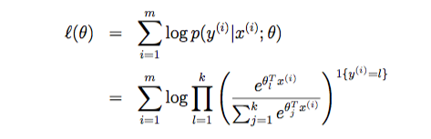

# softmax 回归(logistic回归向多分类的推广)

## 问题建模

softmax回归是logistic回归的推广，它属于多分类模型。仿照logistic的假设函数，softmax的假设函数可表示为:
$$
h_\theta(X) = 
\left[
    \begin{matrix}
    \frac{\exp(\theta_1^TX)}{\sum_{j=1}^{k}\exp(\theta_j^TX)} \\
    \vdots \\
    \frac{\exp(\theta_{k-1}^TX)}{\sum_{j=1}^{k}\exp(\theta_j^TX)}
    \end{matrix}
\right]
$$

##问题解决算法

通过对数似然来得到代价函数，并通过最大化对数似然函数来求解参数$\theta$。对数似然函数如下:

这里的$\theta$是一个矩阵。需要逐个求出$\theta_i$，i=1,2,...,k。利用logistic二分类的思想，在求$\theta_i$的时候把它是为正样本的参数，把其他$\theta$视为常量为负样本的参数。

> **注:**代码实现参照logistc regression的OneVsRest方法。