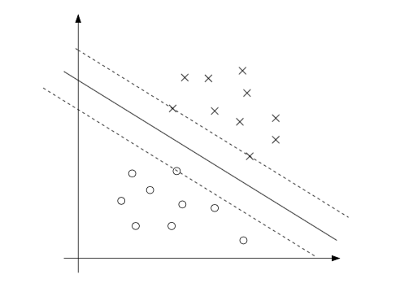

#SVM-part1

##引言

通过Logistic Regression得知概率密度函数$p(y=1|X;\theta) = h_\theta(X)=g(\theta^TX)$，表示给定X和$\theta$ ，y=1的概率。这里我们设置阈值为0.5，即$h_\theta(X) \geq 0.5$时，把y预测为1，也就是当$\theta^TX \geq 0$时，把y预测为1。同样的，$\theta^TX$越大，$h_\theta(X)$的值也会越大，预测y为1的自信也就越大。 

所以我们得到这样的推断，如果$\theta^TX \gg 0$，y=1，相似的，如果$\theta^TX \ll 0$，y=0。给定一个样本，当y=1的时候，我们可以找到一个$\hat{\theta}$使得$\theta^TX \gg 0$，当y=0的时候，可以找到一个$\hat{\theta}$使得$\theta^TX \ll 0$。稍后会使用函数间隔的概念来形式化上面的问题。

上图显示(这里假定X表示正样本1，O表示负样本0)，直线表示**分类超平面**$\theta^TX=0$，是分类器的决策边界。正如我们所见，A点距离决策边界很远，所以分类器可以很自信的把它划分为y=1，而C点距离决策边界很近，当决策边界稍微变动就很有可能使C点划分为y=0，B点介于两者之间，所属的情况更为广泛(处于这个位置的样本数量是最多，最集中的)。

所以，我们的目标是找到一个决策边界，是的所有的样本都被正确的分类，而且更有自信的分类。稍后我们会使用几何间隔的概念来形式化上面的问题。

## 假设函数

假设函数
$$
h_{w,b}(X) = g(W^TX+b)
$$
在这里，当$z \geq 0$ ，$g(z) = 1$，$z < 0$，$g(z)=-1$。

## 函数间隔和几何间隔

### 函数间隔

给定一个样本$(X^i,y^i)$ ，我们定义参数为$(W, b)$的函数间隔为:
$$
\hat{\gamma}^i = y^i(W^TX+b)
$$
根据前面的推断，当$y^i=1$时，$\hat{\gamma}^i \gg 0$会很大，同理地，当$y^i = -1$时，$\hat{\gamma}^i \gg 0$。所以，当样本$(X^i,y^i)$是正样本时，我们需要使$W^TX+b$是一个很大的正整数，相反地，如果为负样本，那么我们需要使$W^TX+b$是一个绝对值很大的负整数。所以，当$\hat{\gamma}^i > 0$时，样本被正确分类，同时函数间隔越大，表示该样本被正确分类的信心越大。

注意：函数间隔存在一个不足之处，令$W=2W,b=2b$时，并不会改变假设函数$h_\theta(X)$的结果，但是会使函数间隔缩放2倍。这也说明了，函数间隔可以随意缩放，而不会产生任何有意义的变化。

**更一般的，定义函数间隔**：

给定一个训练样本$S={(X^i,y^i),i=1,2,\dots,m}$，令$\hat{\gamma} = \min_\limits{i=1,\dots,m} \hat{\gamma}^i$。

### 几何间隔

分类超平面为$W^TX+b = 0$，对应的向量$W$为分类超平面的法向量。A点表示样本$(X^i, y^i=1)$的$X^i$特征，点A到决策边界的距离表示为$\gamma^i$(线段AB的长度)，点B就可以表示为$X^i-\gamma^i.\frac{W}{\|W\|}$ ，其中$\frac{W}{\|W\|}$表示分类超平面的单位法向量。因为B点在分类超平面上，所以：
$$
W^T(X^i-\gamma^i.\frac{W}{\|W\|})+b = 0
$$
解出，$\gamma^i = \frac{W^TX^i+b}{\|W\|}=(\frac{W}{\|W\|})^TX^i+\frac{b}{\|W\|}$。

更一般的，把几何间隔表示为：
$$
\gamma^i = y^i((\frac{W}{\|W\|})^TX^i+\frac{b}{\|W\|})
$$
**注意:**当$\|W\|=1$时，几何间隔等于函数间隔。同时，无论如何缩放W和b，都不会改变几何间隔。因此，我们就可以对几何间隔增加的参数增加任意的缩放约束条件，也不会改变几何函数的求解。

**最后，修正几何间隔为：**

给定一个训练样本$S={(X^i,y^i),i=1,2,\dots,m}$，令$\gamma = \min_\limits{i=1,\dots,m} \gamma^i$。

## 最优间隔分类器

> 根据前面的讨论，我们可以通过最大化几何间隔得到一个最优的决策边界使得测试样本被更好的正确分类。

假设给定训练样本是线性可分的，也就是存在一些分类超平面可以把正负样本正确分开。现在我们的问题是，如何找到一个分类超平面使得几何间隔最大化，**目标函数为:**
$$
\max_{\gamma,W,b} \gamma \\
S.T. \ y^i(W^TX^i+b) \geq \gamma \ ，i=1,\dots,m \\
\|W\|=1
$$
约束条件表示所有的样本的几何间隔都大或等于$\gamma$，同时保证$\|W\|=1$使得几何间隔和函数间隔保持一致。

但是，约束函数$\|W\|=1$不是凸函数，无法使用凸优化来对上面的函数求解。**目标函数更正为:**
$$
\max_{\hat{\gamma},W,b} \frac{\hat{\gamma}}{\|W\|} \\
S.T. \ y^i(W^TX^i+b) \geq \hat{\gamma} \ ，i=1,\dots,m
$$
虽然约束条件都是凸集，但是目标函数却变成了非凸函数。但是由于上面我们可以知道随意缩放W,b也不会改变几何间隔的值，所以这里令$\hat{\gamma} = 1$。

**那么目标函数更正为:**
$$
\max_{W,b} \frac{1}{\|W\|} \\
S.T. \ y^i(W^TX^i+b) \geq 1 \ ，i=1,\dots,m
$$
由于最大化$\frac{1}{\|W\|}$，相当于最小化$\|W\|^2$，所以**目标函数更正为:**
$$
\min_{W,b} \frac{1}{2}\|W\|^2 \\
S.T. \ y^i(W^TX^i+b) \geq 1 \ , i=1,\dots,m
$$
上面的问题属于二次规划(QP)问题带有线性约束，也是凸优化问题。至此，我们就得到了最优间隔分类器。

## 拉格朗日对偶

> 有约束最优化问题。

###原始形式

考虑如下问题：
$$
\min_W f(W) \\
S.T. \ h_i(W)=0 \ , i=1,\dots,l
$$
使用[拉格朗日乘数法](https://zh.wikipedia.org/wiki/%E6%8B%89%E6%A0%BC%E6%9C%97%E6%97%A5%E4%B9%98%E6%95%B0)来求解上述问题：
$$
\mathcal{L} (W,\beta) = f(W)+\sum_{i=1}^{l}\beta_ih_i(W)
$$
这里，$\beta_i$称为拉格朗日乘数。通过设置拉格朗日函数的对$W,\beta$的偏导为0，来求解$W,\beta$:
$$
\frac{\partial{\mathcal{L}}}{\partial{W_i}} = 0 \ ; \frac{\partial{\mathcal{L}}}{\partial{\beta_i}} = 0
$$
我们是上面的拉格朗日函数更加一般化，使之同时包含不等式约束和等式约束。下面问题我们称为**最优化问题的原始形式**：
$$
\min_w f(W)  \\
S.T. g_i(W) \leq 0 \ , i=1,\dots,k \\
h_i(W) = 0，i=1,\dots,l
$$
为了解决上述问题，我们定义了**拉格朗日的一般形式**：
$$
\mathcal{L}(W,\alpha,\beta) = f(W)+\sum_{i=1}^{k}\alpha_i g_i(W)+\sum_{i=1}^{l}\beta_ih_i(W)
$$
$\alpha_i\ , \beta_i$为拉格朗日乘数。令：
$$
\theta_{\mathcal{P}}(W) = \max_{\alpha,\beta:\alpha_i\geq0} \mathcal{L}(W,\alpha,\beta)
$$
下标$\mathcal{P}$表示"原始形式"。如果给定的W不满足约束条件，那么导致$\theta_{\mathcal{P}}(W) = \infty$：
$$
\begin{equation}
\theta_{\mathcal{P}}(W)=\left\{
\begin{aligned}
f(W) & & 若W 满足约束条件 \\
\infty & & 其他
\end{aligned}
\right.
\end{equation}
$$
所以，当W满足约束条件的时候，$\theta_{\mathcal{P}}$等于$f(W)$，所以上述的**最优化问题的原始形式**可以变成以下形式：
$$
\min_{W}\theta_{\mathcal{P}}(W) = \min_{W} \max_{\alpha,\beta;\alpha_i\geq0} \mathcal{L}(W,\alpha,\beta)
$$
令$p^* = \min_{W} \theta_{\mathcal{P}}(W)$，$p^*$也叫做原始问题的值。

### 对偶形式

定义:
$$
\theta_{\mathcal{D}}(\alpha, \beta) = \min_{W} \mathcal{L}(W,\alpha,\beta)
$$
假设$\widetilde{W}$满足约束条件，则:
$$
\min_{W} \mathcal{L}(W,\alpha,\beta) \leq \mathcal{L}(\widetilde{W},\alpha,\beta) \\
\mathcal{L}(\widetilde{W},\alpha,\beta) = f(\widetilde{W})+\sum_{i=1}^{k}\alpha_i g_i(\widetilde{W})+\sum_{i=1}^{l}\beta_ih_i(\widetilde{W}) \leq f_0(\widetilde{W})
$$
所以：
$$
\min_{W} \mathcal{L}(W,\alpha,\beta) \leq p^*
$$
下标$\mathcal{D}$表示“对偶”。根据上面的原始形式，很快得到**最优化问题的对偶形式：**
$$
\max_{\alpha,\beta;\alpha_i \geq 0} \theta_{\mathcal{D}}(\alpha, \beta) = \max_{\alpha,\beta;\alpha_i \geq 0} \min_{W} \mathcal{L}(W,\alpha,\beta)
$$
令$d^* = \max_{\alpha,\beta;\alpha_i \geq =0} \theta_{\mathcal{D}}(W)$，$d^*$也叫对偶问题的值。

### 结论

$$
d^* = \max_{\alpha,\beta;\alpha_i \geq 0} \min_{W} \mathcal{L}(W,\alpha,\beta) \leq \min_{W} \max_{\alpha,\beta;\alpha_i \geq 0} \mathcal{L}(W,\alpha,\beta) = p^*
$$

对于凸优化问题强对偶条件成立时，上面的不等式会变成等式$d^*=p^*$。所以，我们可以**通过求解对偶问题来解决原始问题**。强对偶条件成立，表示一定存在$W^*,\alpha^*,\beta^*$，其中$W^*$是原始问题的解，$\alpha^*,\beta^*$为对偶问题的解。也就是$d^*=p^*=\mathcal{L}(W^*,\alpha^*,\beta^*)$。

**Karush-Kuhn-Tucker(KKT)条件:**
$$
\frac{\partial}{\partial W_i} \mathcal{L}(W^*,\alpha^*,\beta^*) = 0 \ , i=1,\dots,n \tag{1}
$$

$$
\frac{\partial}{\partial \beta_i} \mathcal{L}(W^*,\alpha^*,\beta^*) = 0 \ , i=1,\dots,l \tag{2}
$$

$$
\alpha_i^* g_i(W^*) = 0 \ , i=1,\dots,k \tag{3}
$$

$$
g_i(W^*) \leq 0 \ , i=1,\dots,k \tag{4}
$$

$$
\alpha_i^* \geq 0 \ , i=1,\dots,k \tag{5}
$$

对于公式(3)叫做对偶互补条件，它表示当$\alpha_i^* > 0​$，$g_i(W^*) = 0​$，当$\alpha_i^* = 0​$，$g_i(W^*) < 0​$。

所有满足KKT条件的$W^*,\alpha^*,\beta^*$，都是原始问题和对偶问题的解。

#### 凸优化问题的标准形式

- 凸优化问题

$$
\min f(X) \\
S.T. g_i(X) \leq 0 \ , i=1,\dots,k \\
h_i(X) = 0 \ , i=1,\dots,l
$$

- 则有$f(X)$是凸函数，可行域是凸集
  - 目标函数是凸函数
  - 不等式约束函数必须是凸的
  - 等式约束函数必须是仿射的
- 最优值(目标函数在可行域上的最小值)
  - $p^* = +\infty$ 不可行(可行域是空集)
  - $p^* = -\infty$ unbounded below(存在可行点使得$f(X)\rightarrow -\infty$)
  - $f(X^*)=p^*$ 有解

## 最优间隔分类器(硬间隔)

下面我们给出最优间隔分类器的原始形式：
$$
\min_{\gamma,W,b} \frac{1}{2}\|W\|^2 \\
S.T. y^i(W^TX^i+b) \geq 1 \ , i=1,\dots,m
$$
对应的，我们可以把约束条件表示成如下形式：
$$
g_i(W) = -y^i(W^TX^i+b)+1 \leq 0
$$
根据KKT的互补条件，$\alpha_i > 0$，当且仅当函数间隔等于1($y^i(W^TX^i+b)=1$)。

实线表示最优间隔分类器的分类超平面。最小几何间隔对应的3个样本点，分别是1个负样本和2个正样本，它们都分别在平行于分类超平面的两条虚线上。因此，只有存在3个满足$\alpha_i > 0$。这三个样本点叫做**支持向量**。事实上，支持向量的个数越小于训练样本数越好。

把最优间隔分类器问题写成**拉格朗日函数形式**：
$$
\mathcal{L}(W,b,\alpha) = \frac{1}{2}\|W\|^2 - \sum_{i=1}^{m}\alpha_i[y^i(W^TX^i+b)-1] \tag{6}
$$
接着，我们找出**拉格朗日函数的对偶形式**:
$$
d^* = \max_{\alpha\geq0}(\min_{W,b}\mathcal{L}(W,b,\alpha))
$$
令$\mathcal{L}(W,b,\alpha)$对W和b的偏导为0，则有：
$$
\nabla_W \mathcal{L}(W,b,\alpha) = W-\sum_{i=1}^{m}\alpha_iy^iX^i = 0
$$
得出：
$$
W = \sum_{i=1}^{m}\alpha_iy^iX^i \tag{7}
$$

$$
\frac{\partial}{\partial b} \mathcal{L}(W,b,\alpha) = \sum_{i=1}^{m}\alpha_iy^i = 0 \tag{8}
$$

把公式(7)代入公式(6):
$$
\mathcal{L}(W,b,\alpha) = \sum_{i=1}^{m}\alpha_i - \frac{1}{2}\sum_{i=1}^{m}\sum_{j=1}^{m}\alpha_i\alpha_jy^iy^j(X^i)^TX^j - b\sum_{i=1}^{m}\alpha_iy^i \tag{9}
$$
把公式(8)代入公式(9):
$$
\mathcal{L}(W,b,\alpha) = \sum_{i=1}^{m}\alpha_i - \frac{1}{2}\sum_{i=1}^{m}\sum_{j=1}^{m}\alpha_i\alpha_jy^iy^j(X^i)^TX^j \tag{10}
$$
至此，对偶形式变为:
$$
\max_{\alpha} W(\alpha) = \sum_{i=1}^{m}\alpha_i - \frac{1}{2}\sum_{i=1}^{m}\sum_{j=1}^{m}\alpha_i\alpha_jy^iy^j((X^i)^TX^i) \\
S.T. \ \alpha_i \geq 0 \ , i=1,\dots,m \\
\sum_{i=1}^{m}\alpha_iy^i = 0
$$

假定通过对偶形式求解出$\alpha^*$，根据KKT有：

- $\alpha_i^* (y^i((W^*)^TX^i+b^*) - 1)= 0$
- $\alpha_i((W^*)^TX^i+b^*) \geq 1$
- $\alpha_i^* \geq 0$

把求出来的$\alpha_i^*$代入公式(7),可得$W^* = \sum_\limits{i=1}^{m}\alpha_i^*y^iX^i$，同时代入公式(8)，可得$\sum_\limits{i=1}^{m}\alpha_i^*y_i = 0$。

根据**支持向量**的定义，若$\alpha_j^* = 0$，对$W^*$无贡献，若$\alpha_j^* > 0$，则$y^j((W^*)^TX^j+b^*) = 1$。

所以$W^*$代入$y^i((W^*)^TX^i+b^*) = 1$，则$b^* = y_j - \sum_\limits{i=1}^{m}\alpha_i^*y^i\left<X_i^TX_j\right>$。(注意:$j$表示支持向量的样本下标)。

更一般的，根据**支持向量**的定义，支持向量所在的虚线，可以分别表示为:

- 当y=1时，$(W^*)^TX+b^*+\widetilde{b}$
- 当y=-1时，$(W^*)^TX+b^*-\widetilde{b}$

此处，$\widetilde{b}$是最小几何间隔，也就是虚线到分类超平面之间的距离。所以，$b^*$还可以是以下的表达形式:
$$
b^* = - \frac{\max_\limits{i=1,y^i=-1}^{m}(W^*)^TX^i+\min_\limits{j=1,y^j=1}^{m}(W^*)^TX^j}{2}
$$
根据公式(7)，可得：
$$
W^TX+b = (\sum_\limits{i=1}^{m}\alpha_iy^iX^i)^TX+b \tag{11} = \sum_\limits{i=1}^{m}\alpha_iy^i\left< X^i,X \right>+b
$$
所以，只要找到了支持向量对应$\alpha$就可以通过计算样本特征与支撑向量间的內积来进行预测。

参考:

- [cs229-note3](http://cs229.stanford.edu/notes/cs229-notes3.pdf)
- [cs229-video](https://open.163.com/movie/2008/1/C/6/M6SGF6VB4_M6SGJVMC6.html)
