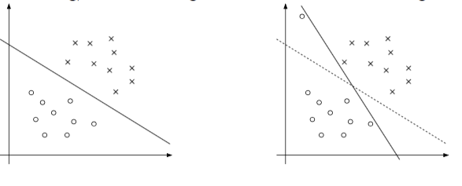
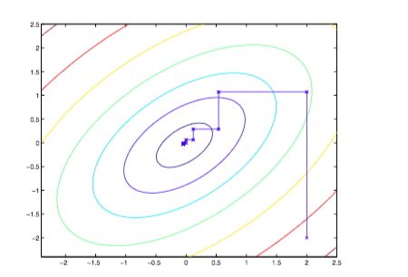
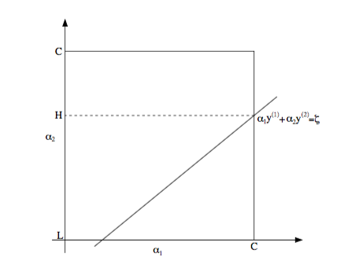
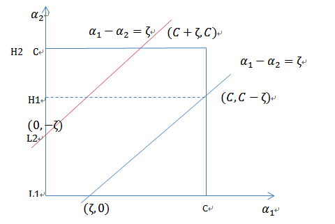

# SVM-part2

## 核函数

> 在多项式回归里举过一个例子房屋面积和售价的关系，使用线性回归的方式拟合非线性函数。即令$h_\theta(x) = \theta_0+\theta_1x+\theta_2x^2+\theta_3x^3$。为了应用线性回归求解这个问题，我们使用$x_1,x_2,x_3$来分别表示$x_1=x,x_2=x^2,x_3=x^3$。所以假设函数修正为$h_\theta(X) = \theta^TX=\theta_0+\theta_1x_1+\theta_2x_2+\theta_3x_3$。但是这里我们使用映射的思想来描述以上三次多项式的构建，就是把输入房屋面积$x$，映射成$[x,x^2,x^3]$更高维度的特征向量。使用映射得到的特征向量来构建模型求解问题。构建关系表示为:
> $$
> \phi(x) = [x,x^2,x^3]^T
> $$
>

回顾前面的最优间隔分类器最终的净输入函数$W^TX+b$变成了求样本特征向量之间的内积了即$\left<X,Z\right>$，根据前面的多项式的映射升维思想，内积应该变成$\left<\phi(X),\phi(Z)\right>$，特别的引出了kernel函数的表达式：
$$
K(X,Z) = \phi(X)^T\phi(Z)
$$
举例说明即使kernel函数在处理高维度数据时会大大提高计算效率：

令$X,Z \in R^n$，$K(X,Z) = (X^TZ)^2$:
$$
K(X,Z) = (\sum_{i=1}^{n}x_iz_i)(\sum_{j=1}^{n}x_jz_j) \\
= \sum_{i=1}^{n}\sum_{j=1}^{n}x_ix_jz_iz_j \\
= \sum_{i,j=1}^{n}(x_ix_j)(z_iz_j)
$$
使用前面的定义$K(X,Z)=\phi(X)\phi(Z)$，假设$X=[x_1,x_2,x_3]^T$，那么$\phi(X) = [x_1x_1,x_1x_2,x_1x_3,x_2x_1,x_2x_2,x_2x_3,x_3x_1,x_3x_2,x_3x_3]^T$。注意，这里计算$\phi(X)$的时间复杂度为$O(N^2)$，而$K(X,Z)$的时间复杂度为$O(N)$。

更一般地，$K(X,Z)=(X^TZ+c)^2=\sum_\limits{i,j=1}^{n}(x_ix_j)(z_iz_j)+\sum_\limits{i=1}^{n}(\sqrt{2c}x_i)(\sqrt{2c}z_i)+c^2$。而对应的$\phi(X)$为：

$\phi(X) = [x_1x_1,x_1x_2,x_1x_3,x_2x_1,x_2x_2,x_2x_3,x_3x_1,x_3x_2,x_3x_3,\sqrt{2c}x_1,\sqrt{2c}x_2,\sqrt{2c}x_3,c]^T$。这里参数c是用来控制单项式和二项式之间的相关权重的。更进一步推广，$K(X,Z)=(X^TZ+c)^d$，所对应$\phi(X)$的特征维度为 ${\displaystyle {\tbinom {n+d}{d}}}$(二项式定理)。

从另外的角度来思考核函数。如果$\phi(X)$和$\phi(Z)$很相近，那么$K(X,Z)$的值会很大，反之，如果$\phi(X)$和$\phi(Z)$的相关性很小，那么$K(X,Z)$的值也会很小。所以，我们也可以把核函数作为衡量两个向量之间的相似度。

所以，当你遇到需要衡量两个向量之间的相似度时，自然而然的就想到使用核函数来解决，比如高斯核函数：
$$
K(X,Z) = \exp(-\frac{\|X-Z\|^2}{2\sigma^2})
$$
当X和Z很相似的时候，核函数值近似为1，而两者几乎没有相似度时，核函数值近似为0.

### 核函数的有效性

**问题:**如何确定核函数是有效的，也就是是否存在$\phi$使得$K(X,Z)=\phi(X)^T\phi(Z)$？

**证明：**假设有m个训练样本${X^1,X^2,\dots,X^m}$，定义一个$m \times m$的核矩阵K，$K_{ij}=K(X^i,X^j)$。如果K是一个有效核函数，那么一定满足:$K_{ij}=K(X^i,X^j)=\phi(X^i)\phi(X^j)=\phi(X^j)\phi(X^i)=K_{ji}$。也就是核矩阵为对称矩阵。现使用$\phi_k(X)$表示向量$\phi(X)$的第k个元素，对任意向量Z都有:
$$
Z^TKZ = \sum_{i}\sum_{j}z_iK_{ij}z_j \\
= \sum_{i}\sum_{j}z_i\phi(X^i)^T\phi(X^j)z_j \\
= \sum_{i}\sum_{j}z_i(\sum_{k}\phi_k(X^i)\phi_{k}(X^j))z_j \\
= \sum_{k}\sum_{i}\sum_{j}z_i\phi_k(X^i)\phi_k(X^j)z_j \\
= \sum_{k}(\sum_{i}z_i\phi_k(X^i))^2 \geq 0
$$
最后一步跟前面计算$K(X,Z)=(X^TZ)^2$类似。从公式可以看出，如果K是一个有效的核函数，那么在训练集上得到的核函数矩阵应该是半正定的。这也是Mercer定理:

K是有效核函数 <=> 核函数矩阵K是对称半正定的。

从Mercer定理可知证明K是否为有效核函数，不需要找到映射函数$\phi$，只需要在训练集上求出核矩阵K,并判断该矩阵是否是半正定的即可。

注:核函数不仅用在SVM上，但凡算法中出现$\left<X,Z\right>$，都可以使用$K(X,Z)$来替换。

## 软间隔(目标函数)

之前我们讨论过，当样本存在线性不可分的情况时，我们可以通过核函数把特征映射到更高维度的空间中，这样就可以把样本分开了，但是并非对所有的线性不可分情况都有效。所以，如果使用核函数方法依然无法是样本集完全可分，那么我们可以通过对模型进行调整，尽可能的找到那个最好的决策边界。

上图显示，左图得到一个最优的决策边界，但是右图中由于存在一个离群点导致决策边界发生改变，使得函数间隔变得非常小。由此可见，之前的**最优间隔分类器的模型对噪声非常敏感**。

为了解决这些问题，我们需要对之前的目标函数进行修正，得到新的模型(也成软间隔):
$$
\min_{\gamma,W,b} \frac{1}{2}\|W\|^2 +C\sum_{i=1}^{m}\xi_i \\
S.T. \ y^i(W^TX^i+b) \geq 1-\xi_i \ ， i=1 ,\dots,m \\
\xi_i \geq 0 \ ，i=1,\dots,m.
$$
引入非负参数$\xi_i$(松弛变量)，也就是允许一些样本点被错误分类。而放松限制条件后，我们需要重新调整目标函数，以对离群点进行处罚，目标函数后面加上了$C\sum_{i=1}^{m}\xi_i $表示离群点越多(被错误分类的点越多)，目标函数值越大。这里的C表示离群点的权重，C越大，表示对离群点的惩罚越大，降低离群点对模型的影响。

相应地，拉格朗日函数修正如下:
$$
\mathcal{L}(W,b,\xi,\alpha,\beta) = \frac{1}{2}\|W\|^2+C\sum_{i=1}^{m}\xi_i - \sum_{i=1}^{m}\alpha_i[y^i(X^TW+b)-1+\xi_i]-\sum_{i=1}^{m}\beta_i\xi_i
$$
对偶形式修正如下:
$$
\max_\alpha W(\alpha) = \sum_{i=1}^{m}\alpha_i - \frac{1}{2}\sum_{i,j=1}^{m}y^iy^j\alpha_i\alpha_j\left<X^i,X^j\right> \\
S.T. 0 \leq \alpha_i \leq C \ ，i=1,\dots,m \\
\sum_{i=1}^{m}\alpha_iy^i=0
$$
此时，可以看到参数$\xi_i$没有了，唯一的不同之处在于$\alpha_i$多了一个限制条件即小于C。应用KKT条件，可得:
$$
\alpha_i = 0 \Rightarrow y^i(W^TX^i+b) \geq 1 \tag{1}
$$

$$
\alpha_i=C \Rightarrow y^i(W^TX^i+b) \leq 1 \tag{2}
$$

$$
0 < \alpha_i < C \Rightarrow y^i(W^TX^i+b) = 1 \tag{3}
$$

通过上线的式子可以得知，非支持向量正确分类样本系数为0，表示没有惩罚。对于错误分类的样本系数为C，增加了惩罚项。对于支持向量的样本点，系数为(0,C)之间，也就是说，支持向量对应的样本点也有可能是被错误分类的点。所以存在惩罚项。

## SMO算法(序列最小优化算法)

### 坐标上升法

坐标上升法求解对偶形式的目标函数，过程为，固定除了$\alpha_i$以外的所有$\alpha$,找到使得$W(\alpha)$取最大值的$\alpha_i$，然后更新$\alpha_i$，逐步使用同样的方式按照顺序更新$\alpha_1$,$\dots$,$\alpha_m$，直到$W(\alpha)$收敛。

### SMO

> SMO是二次规划优化算法，特别是针对线性SVM和数据稀疏时性能很好。

前面的坐标上升法是无约束目标函数的求解方式，但是我们的对偶形式目标函数存在约束$\sum_\limits{i=1}^{m}\alpha_iy^i = 0$,$0 \leq \alpha_i \leq C$。因此，我们需要对坐标上升法进行改进，选中两个参数$\alpha_i,\alpha_j$来同时更新，而剩余的参数固定。根据约束条件，可得:
$$
\alpha_1y^1+\alpha_2y^2 = -\sum_{i=3}^{m}\alpha_iy^i
$$
由于剩余的参数是固定的，所以我们可以把等式右边表示为$\zeta$。即：
$$
\alpha_1y^1+\alpha_2y^2 = \zeta
$$
然后，同时满足另外的约束条件，即可得出下图：

上图所示$L \leq \alpha_2 \leq H$。同时得到$\alpha_1 = (\zeta-\alpha_2y^2)y^1$，然后得到$W(\alpha) = W((\zeta-\alpha_2y^2)y^1,\alpha_2,\dots,\alpha_m)$。$W$函数就变成了关于$\alpha_2$的函数，通过求导，使导数为0，求得$\alpha_2$，然后更新$\alpha_1,\alpha_2$。求得的$\alpha_2$的结果必须满足$L \leq \alpha_2 \leq H$。可以通过以下公式修正求导得到的$\alpha_2$。
$$
\begin{equation}
\alpha_2=\left\{
\begin{aligned}
H & & 若\alpha_2 > H \\
\alpha_2 & & 若 L \leq \alpha_2 \leq H \\
L & & 若\alpha_2 < L
\end{aligned}
\right.
\end{equation}
$$

由上图可知，当$y^1 \neq y^2$时，$\alpha_1-\alpha_2=\zeta$，L和H的取值为:

$L = \max(0, \zeta)=\max(0, \alpha_1-\alpha_2)$

$H = \min(C, C-\zeta)=\min(C,C-\alpha_1+\alpha_2)$

同理可得，当$y^1=y^2$时，$\alpha_1+\alpha_2=\zeta$，L和H的取值为:

$L=\max(0,\zeta-C)=\max(0,\alpha_1+\alpha_2-C)$

$H=\min(C,\zeta)=\min(C,\alpha_1+\alpha_2)$

#### 更新的规则

令,

$g(X) = \sum_\limits{i=1}^{N}\alpha_iy^iK(X^i,X)+b$

$E_i = g(X^i)-y^i=(\sum_\limits{j=1}^{N}\alpha_jy^jK(X^j,X^i)+b)-y^i$，$i=1,2$

$\alpha_2 = \alpha_2^{old}+\frac{y^2(E_1-E_2)}{\eta}$

$\eta = K_{11}+K_{22}-2K_{12}=\|\phi(X^1)-\phi(X^2)\|^2$

$\alpha_1=\alpha_1^{old}+y^1y^2(\alpha_2^{old}-\alpha_2)$

证明:

使用二次规划的求解方法，可以将软间隔的对偶形式目标函数，变形为:

$\min_{\alpha_1,\alpha_2}=\frac{1}{2}K_{11}\alpha_1^2+\frac{1}{2}K_{22}\alpha_2^2+y^1y^2K_{12}\alpha_1\alpha_2-(\alpha_1+\alpha_2)+y^1\alpha_1\sum_\limits{i=3}^{m}y^i\alpha_iK_{i1}+y^2\alpha_2\sum_\limits{i=2}^{m}y^i\alpha_iK_{i2}$

$S.T. \alpha_1y^i+\alpha_2y^2=-\sum_\limits{i=3}^{m}y^i\alpha_i=\zeta$

​         $0 \leq \alpha_i \leq C$，$i=1,2$

**新的目标函数省略了不含有$\alpha_1,\alpha_2$的常数项。**

$v_i = \sum_\limits{j=3}^{m}\alpha_jy^jK_{ij}=g(X^i)-\sum_\limits{j=1}^{2}\alpha_jy^jK_{ij}-b$，i=1,2

代价函数更正为:

$W(\alpha_1,\alpha_2)=\frac{1}{2}K_{11}\alpha_1^2+\frac{1}{2}K_{22}\alpha_2^2+y^1y^2K_{12}\alpha_1\alpha_2-(\alpha_1+\alpha_2)+y^1v_1\alpha_1+y^2v_2\alpha_2$

把$\alpha_1 = (\zeta-\alpha_2y^2)y^1$代入代价函数中，可得:

$W(\alpha_2)=\frac{1}{2}K_{11}( \zeta-\alpha_2y^2)^2+\frac{1}{2}K_{22}\alpha_2^2+y^2K_{12}(\zeta-\alpha_2y^2)\alpha_2- (\zeta-\alpha_2y^2)y^1-\alpha_2+v_1 (\zeta-\alpha_2y^2)+y^2v_2\alpha_2$

对$\alpha_2$求导，

$\frac{\partial{W}}{\partial{\alpha_2}} = K_{11}\alpha_2+K_{22}\alpha_2-2K_{12}\alpha_2-K_{11}\zeta y^2+K_{12}\zeta y^2+y^1y^2-1-v_1y^2+y^2v_2$

令导数为0,得到：

$(K_{11}+K_{22}-2K_{12})\alpha_2 = y^2(y^2-y^1+\zeta K_{11}-\zeta K_{12}+v_1-v_2)$

把$v_i$和$\zeta = \alpha_1^{old}y^1+\alpha_2^{old}y^2$，两个公式代入上式，得到

$(K_{11}+K_{22}-2K_{12})\alpha_2 = (K_{11}+K_{22}-2K_{12})\alpha_2^{old}+y^2(E_1-E_2)$

令$\eta = K_{11}+K_{22}-2K_{12}$代入公式，于是得到:

$\alpha_2 = \alpha_2^{old}+\frac{y^2(E_1-E_2)}{\eta}$

**此处，需要使用L,H对$\alpha_2$进行修正。**

