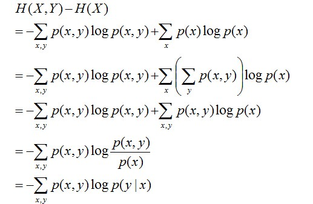
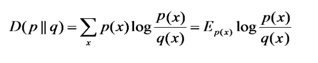
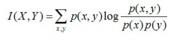
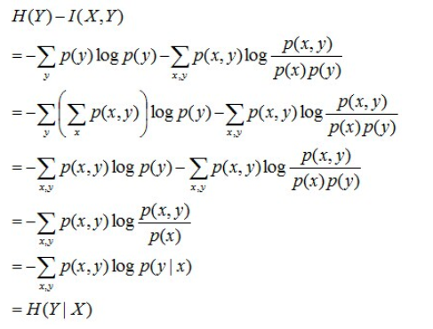

# 第五章 决策树

决策树是一种基本的分类与回归方法.本章主要讨论分类决策树.决策树模型,在分类问题中,可以认为是**if-then规则的集合**,也可以认为是**定义在特这空间与类空间上的条件概率分布**.决策树学习通常包括3个步骤:**特征选择,决策树生成,决策树剪枝**.

决策树有三种实现算法:ID3,C4.5,CART.

## 决策树模型与学习

分类决策树模型是一种描述对实例进行分类的**树形结构**.决策树由结点(node)和有向边组成.结点有两种类型:内部结点和叶节点.**内部结点表示一个特征或属性,叶节点表示一个类别**.

### 决策树与if-then规则

将决策树转换成if-then规则的过程:由决策树的根节点到叶节点的**每一条路径构建一条规则**;路径上**内部结点的特征对应着规则的条件**,而叶节点的**类别**对应着规则的**结论**.同时规则之间是**互斥且完备**的.

### 决策树与条件概率分布

决策树表示**给定特征条件下类的条件概率分布**.这一条件概率分布定义在**特征空间的一个划分上**.将特征空间划分为互不相交的单元或区域,并**在每个单元定义一个类的概率分布就构成了一个条件概率分布**(一条路径对应一个单元,也就是对应一个条件概率分布).

## 特征选择

特征选择是决定用哪个特征来划分特征空间.

### 熵

熵表示随机变量不确定性的度量.设X是一个取有限个值的离散随机变量,其概率分布为:
$$
P(X=x_i) = p_i , i=1,2,...,n
$$
则随机变量X的熵定义为:
$$
H(X) = -\sum_{i=1}^{n}p_i \log p_i
$$
由于熵只依赖于X的分布,所以将X的熵记作H(p),即:
$$
H(p) = -\sum_{i=1}^n p_i \log p_i
$$
熵越大,随机变量的不确定性就越大,则满足:
$$
0 \leq H(p) \leq \log n
$$

### 条件熵

条件熵$H(Y|X)$表示在已知给定随机变量X的条件下随机变量Y的不确定性.给定随机变量X的条件下随机变量Y的条件熵H(Y|X)定义为:
$$
H(Y|X) = \sum_{i=1}^{n}p_iH(Y|X=x_i) , p_i = P(X=x_i) , i=1,2,...,n
$$
$H(Y|X)=H(Y,X)-H(X)$,推导如下:

条件熵表示给定X的条件下Y的条件概率分布的熵对X分布的数学期望.

### 相对熵

相对熵又称互熵，交叉熵，鉴别信息，Kullback熵，Kullback-Leible散度,**KL散度**等。设p(x)、q(x)是X中取值的两个概率分布，则p对q的相对熵是：

在一定程度上，相对熵可以**度量两个随机变量的“距离”或者说相似度**，且有$D(p||q) \neq D(q||p)$。另外，值得一提的是，$D(p||q)$是必然大于等于0的。

### 互信息

两个随机变量X，Y的互信息定义为X，Y的联合分布和各自独立分布乘积的相对熵，用I(X,Y)表示：

使用相对熵来定义互信息,则表示为:$I(X,Y)=D(P(X,Y) || P(X)P(Y))$.那么有:

通过上面的推导我们得到互信息的常用定义为:$I(X,Y)= H(X) + H(Y) - H(X,Y)$

### 信息增益

信息增益表示得知特征X的信息而使得类Y的信息的不确定性减少的程度.

特征A对训练数据集D的信息增益g(D,A),定义为集合D的经验熵H(D)与给定特征A的条件下,D的经验条件熵H(D|A)之差,即:
$$
g(D,A) = H(D) - H(D|A)
$$
**一般地,熵与条件熵之差称为互信息(mutual information)**.决策树学习中的信息增益等价于训练数据集中的类与特征的互信息.

**信息增益大的特征具有更强的分类能力**.

> 缺点:以信息增益作为划分训练数据集的准则,存在偏向于选择取值较多的特征的问题.

### 信息增益比

特征A对训练数据集D的信息增益比$g_R(D,A)$定义为其信息增益g(D,A)与训练数据集D关于特征A的值的熵$H_A(D)$之比,即:
$$
g_R(D,A) = \frac{g(D,A)}{H_A(D)}
$$
其中,$H_A(D) = -\sum_{i=1}^{n}\frac{|D_i|}{|D|}\log_2\frac{|D_i|}{|D|}$

## 决策树的生成

### ID3算法(信息增益)

ID3算法的核心是在决策树各个结点上应用信息增益准则选择特征,递归地构建决策树.**ID3相当于用极大似然法进行概率模型的选择**.(因为前面提到了每个单元都是对应一个条件概率分布)

**ID3算法流程:**

输入:训练数据集D,特征集A,阈值$\epsilon$

输出:决策树T

1.若D中所有实例属于同一类$C_k$,则T为单结点树,并将类$C_k$作为该结点的类标记,返回T;(**终止条件**)

2.若A=$\varnothing$,则T为单结点树,并将D中实例数最大的类$C_k$作为该结点的类标记,返回T; (**终止条件**)

3.否则,计算A中各特征对D的信息增益,选择信息增益最大的特征$A_g$

4.如果$A_g$的信息增益小于阈值$\epsilon$ ,则置T为单结点树,并将D中实例数最大的类$C_k$作为该结点的类标记,返回T;

5.否则,对$A_g$的每一可能值$a_i$,依$A_g=a_i$将D分割为若干非空子集$D_i$,将$D_i$中实例数最大的类作为标记,构建子结点,由结点及其子结点构成树T,返回T

6.对第i个子结点,以$D_i$为训练集,以A-{$A_g$}为特征集,递归地调用步骤1~步骤5,得到子树$T_i$,返回$T_i$

> ID3算法只有树的生成,所以该算法生成的树容易产生过拟合.

### C4.5的生成算法(信息增益比)

**C4.5算法流程:**

输入:训练数据集D,特征集A,阈值$\epsilon$

输出:决策树T

1.如果D中所有实例属于同一类$C_k$,则置T为单结点树,并将$C_k$作为该结点的类,返回T

2.如果A=$\varnothing$,则置T为单结点树,并将D中实例数最大的类$C_k$作为该结点的类,返回T

3.否则,计算A中各特征对D的信息增益比,选择信息增益比最大的特征$A_g$

4.如果$A_g$的信息增益比小于阈值$\epsilon$,则置T为单结点树,并将D中实例数最大的类$C_k$作为该结点的类,返回T

5.否则,对$A_g$的每一可能值$a_i$,依$A_g=a_i$将D分割为子集若干非空$D_i$,将$D_i$中实例数最大的类作为标记,构建子结点,由结点及其子结点构成树T,返回T.

6.对结点i,以$D_i$为训练集,以A-{$A_g$}为特征集,递归地调用步骤1~步骤5,得到子树$T_i$,返回$T_i$

## 参考文章

[最大熵模型的数学推导](https://blog.csdn.net/v_july_v/article/details/40508465)

